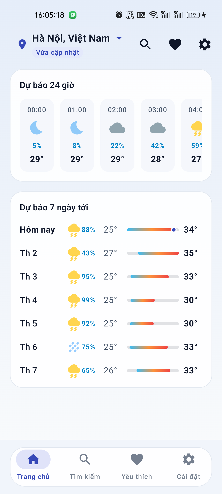
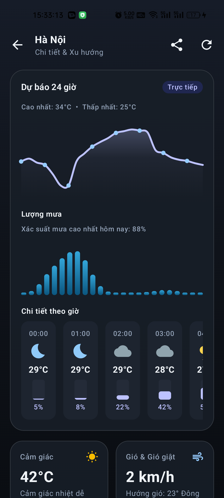
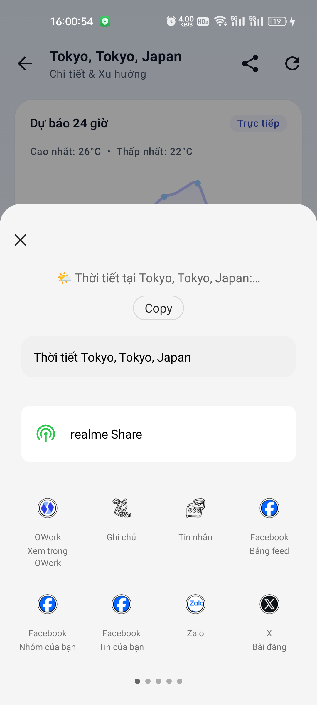
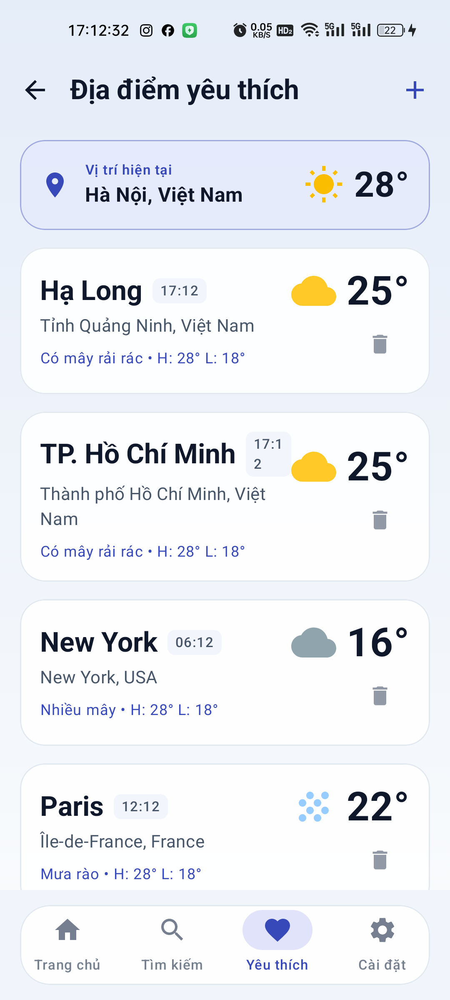
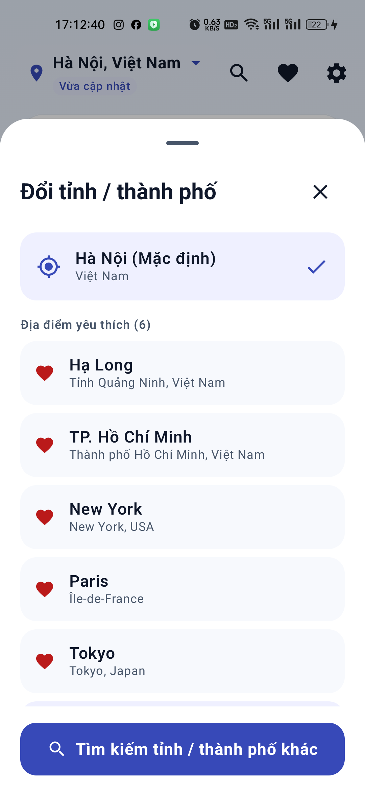
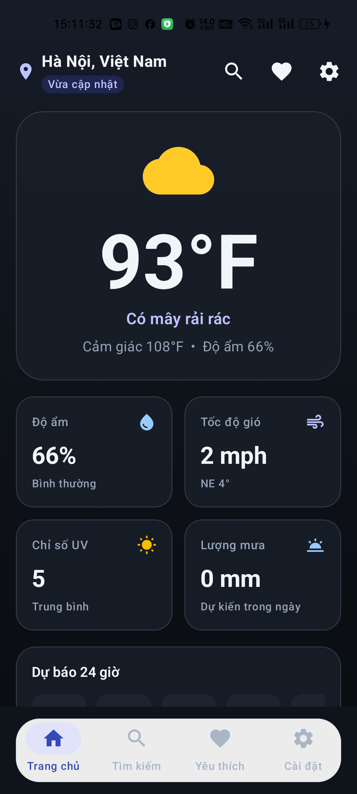
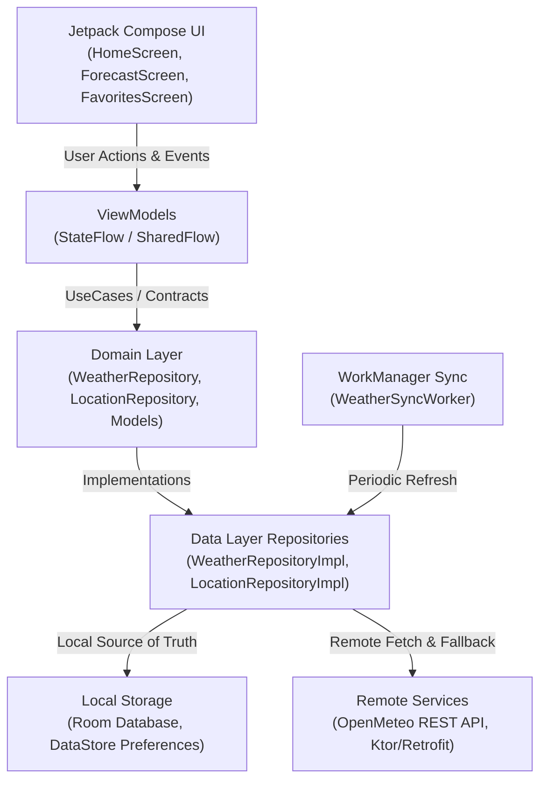

# WeatherNow — Ứng dụng dự báo thời tiết hiện đại, chuẩn Clean Architecture

[](https://github.com/haitranduc203/WeatherNow-AndroidApp/actions/workflows/android.yml)


-brightgreen?logo=junit5)


`WeatherNow` là ứng dụng thời tiết Native Android hiệu năng cao, được phát triển theo tiêu chuẩn kỹ thuật hiện đại: **Clean Architecture**, **MVVM + MVI (UDF)** với 100% **Jetpack Compose** và **Material 3**. Ứng dụng giải quyết bài toán theo dõi thời tiết chính xác, trực quan hóa biểu đồ khí tượng chuyên sâu và duy trì trải nghiệm tức thì nhờ mô hình **Offline-first** lưu trữ cục bộ với **Room Database** & **DataStore**.

> Trạng thái: **Production-ready Portfolio Project**. Dữ liệu khí tượng thời gian thực từ [Open-Meteo REST API](https://open-meteo.com/) (miễn phí, bảo mật không lộ API key), hỗ trợ đầy đủ cơ chế hoạt động ngoại tuyến và đồng bộ ngầm tiết kiệm pin qua WorkManager.

---

## Điểm nổi bật

- **Kiến trúc Clean Architecture & UDF**: Tách biệt hoàn toàn 3 tầng (Data, Domain, Presentation), quản lý trạng thái luồng đơn hướng (Unidirectional Data Flow) qua `StateFlow` và `SharedFlow`.
- **Giao diện Stitch & Glassmorphism**: Thiết kế Material 3 hiện đại, bề mặt kính mờ (`GlassCard`), hiệu ứng vi mô (micro-interactions), hỗ trợ đầy đủ Dark Theme OLED và Light Theme.
- **Trực quan hóa dữ liệu Canvas chuyên sâu**:
  - **Catmull-Rom Cubic Bézier Spline**: Biểu đồ nhiệt độ và lượng mưa 24 giờ siêu mượt với điểm điều khiển động.
  - **Dynamic Range Bars**: Thanh dải nhiệt độ 7 ngày co giãn tương đối theo phổ cực trị tuần kèm chấm định vị thời gian thực (Apple/Pixel Weather style).
- **Offline-First & Smart Cache**: Khởi động tức thì bằng dữ liệu đệm từ **Room SQLite**, tự động làm mới ngầm khi có mạng mà không làm khóa giao diện người dùng.
- **Tra cứu 34 đơn vị hành chính Việt Nam**: Tích hợp danh mục chuẩn theo Nghị quyết 202/2025/QH15 và các đô thị lớn, kèm thuật toán Fuzzy Search chuẩn hóa bỏ dấu tiếng Việt tự động.
- **Đồng bộ thời gian thực 2 chiều**: Cập nhật tức thì giữa Danh sách Yêu thích và Bộ chọn địa điểm Trang chủ (Location Switcher) thông qua reactive Flow.
- **Background Sync & Local Alerts**: Tích hợp **WorkManager** định kỳ cập nhật thời tiết và phát thông báo hệ thống (Notification Channel) với ràng buộc mạng và pin.
- **Chất lượng kiểm thử toàn diện**: 76/76 Unit Tests đạt 100% pass rate cho tầng Domain, Repository, Mappers, và ViewModels với Turbine & MockK.

---

## Giao diện ứng dụng

<p align="center">
  
  
  
</p>
<p align="center">
  
  
  
</p>

---

## Chức năng

### 1. Dự báo thời tiết thời gian thực & Đổi địa điểm linh hoạt
- **Thời tiết hiện tại**: Nhiệt độ thực tế, nhiệt độ cảm nhận (Feels Like), độ ẩm, tốc độ và hướng gió, chỉ số UV, áp suất khí quyển, điểm sương và tầm nhìn.
- **Vị trí đang chọn**: Hiển thị trạng thái địa điểm tức thời với thanh chọn nhanh (Bottom Sheet), chuyển đổi nhanh giữa các thành phố lớn và địa điểm đã lưu.
- **Xử lý trạng thái kết nối**: Tự động hiển thị huy hiệu *"Vừa cập nhật"* hoặc *"Dữ liệu bộ nhớ đệm"* khi mất mạng.

### 2. Trực quan hóa khí tượng & Xu hướng
- **Dự báo 24 giờ**: Trục cuộn ngang hiển thị biểu đồ nhiệt độ đường cong Bézier, lượng mưa theo giờ và trạng thái mây/mặt trời.
- **Dự báo 7 ngày**: Danh sách dự báo tuần với thanh Range Bar động hiển thị nhiệt độ Min/Max của từng ngày trong toàn bộ thang nhiệt độ của tuần.
- **Chu kỳ Mặt Trời & Mặt Trăng**: Thời gian bình minh, hoàng hôn kèm thanh tiến trình quỹ đạo mặt trời.

### 3. Quản lý Địa điểm Yêu thích & Tìm kiếm thông minh
- **Tìm kiếm không giới hạn**: Tra cứu nhanh tỉnh/thành phố toàn quốc (Hà Nội, TP. Hồ Chí Minh, Đà Nẵng, Hải Phòng, Cần Thơ, Hạ Long, Huế, Đà Lạt...) và các thành phố quốc tế (Tokyo, Paris, New York, London, Sydney).
- **Yêu thích tức thì**: Bật/tắt biểu tượng trái tim đỏ (❤️) trong màn chi tiết hoặc thêm trực tiếp qua Bottom Sheet.
- **Xóa & Sắp xếp**: Hỗ trợ thao tác xóa địa điểm yêu thích với phản hồi giao diện tức thì.

### 4. Chia sẻ & Cá nhân hóa
- **Native Android ShareSheet**: Định dạng nội dung tóm tắt thời tiết chi tiết kèm biểu tượng cảm xúc, dễ dàng chia sẻ qua Zalo, Messenger, SMS hoặc Clipboard.
- **Tùy chỉnh đơn vị**: Chuyển đổi linh hoạt giữa °C / °F, km/h / mph / m/s, định dạng 12h/24h.
- **Đa ngôn ngữ & Giao diện**: Hỗ trợ song ngữ Tiếng Việt và Tiếng Anh; hỗ trợ Dark Mode OLED, Light Mode và Theo cài đặt hệ thống.

### 5. Tác vụ ngầm (Background Sync & Notifications)
- **WorkManager**: Lên lịch đồng bộ định kỳ 3 giờ một lần với ràng buộc `NetworkType.CONNECTED` và `BatteryNotLow`.
- **System Notification**: Hiển thị thông báo trạng thái thời tiết và cảnh báo thời tiết cực đoan (mưa bão, chỉ số UV cao).

---

## Kiến trúc

Ứng dụng tuân thủ nghiêm ngặt **Clean Architecture** kết hợp mô hình **MVVM + MVI**:



### Luồng dữ liệu (Data Flow)
1. **Single Source of Truth**: UI luôn quan sát dữ liệu từ **Room Database** và **DataStore** thông qua Kotlin `Flow`.
2. **Stale-While-Revalidate**: Khi người dùng mở app hoặc kéo để làm mới (Pull-to-Refresh), giao diện hiển thị ngay dữ liệu cache từ Room, đồng thời gọi remote API ngầm để cập nhật lại cơ sở dữ liệu.
3. **Thread Safety**: Mọi thao tác truy vấn mạng và cơ sở dữ liệu đều được điều phối trên `Dispatchers.IO`, ngăn ngừa triệt để hiện tượng giật/lag giao diện.

### Cấu trúc thư mục

```text
WeatherNow/
├── app/
│   └── src/main/java/com/example/weathernow/
│       ├── core/               # App container, DI, Network connectivity observer
│       ├── data/
│       │   ├── local/          # Room DB, DAOs, Entities, DataStore Preferences, Catalogs
│       │   ├── remote/         # Retrofit APIs, DTOs, Data Sources
│       │   ├── mapper/         # DTO to Domain model mappers
│       │   └── repository/     # Repository implementations (Offline-first logic)
│       ├── domain/
│       │   ├── model/          # Pure Kotlin models (CurrentWeather, DailyForecast, etc.)
│       │   └── repository/     # Repository interfaces
│       ├── presentation/
│       │   ├── components/     # Reusable UI widgets (GlassCard, BezierChart, RangeBar)
│       │   ├── home/           # HomeScreen, HomeViewModel, LocationSwitcher
│       │   ├── forecast/       # ForecastScreen, ForecastViewModel (Trend analysis)
│       │   ├── favorites/      # FavoritesScreen, FavoritesViewModel, AddFavoriteSheet
│       │   ├── search/         # SearchScreen, SearchViewModel
│       │   ├── settings/       # SettingsScreen, SettingsViewModel
│       │   └── navigation/     # Navigation 3 Host & Screen destinations
│       └── theme/              # Color schemes, Typography, Shapes
├── docs/screenshots/           # Chụp màn hình thực tế từ thiết bị
└── app/src/test/               # 76 Unit tests (Domain, Data, Repository, ViewModels)
```

---

## Công nghệ

| Nhóm | Công nghệ & Thư viện sử dụng |
|---|---|
| **Ngôn ngữ & Nền tảng** | Kotlin `2.3.20`, Android Gradle Plugin `9.0.1`, JDK `17` |
| **Giao diện (UI)** | Jetpack Compose (BOM `2026.03.01`), Material 3, Navigation 3 (`1.0.1`) |
| **Kiến trúc** | Clean Architecture, MVVM, UDF, Kotlin Coroutines, StateFlow, SharedFlow |
| **Dữ liệu cục bộ** | Room Database `2.6.1` (SQLite), DataStore Preferences `1.1.2` |
| **Mạng & Dữ liệu** | Retrofit `2.11.0`, OkHttp `4.12.0`, Kotlinx Serialization `1.7.3`, Open-Meteo API |
| **Tác vụ ngầm** | AndroidX WorkManager `2.10.0` |
| **Kiểm thử** | JUnit `4.13.2`, MockK `1.13.13`, CashApp Turbine `1.2.0`, Coroutines Test |

---

## Bảo mật và tính toàn vẹn dữ liệu

- **Zero-Secret Client**: Sử dụng hạ tầng mở Open-Meteo không đòi hỏi nhúng private API keys vào file APK, loại bỏ hoàn toàn nguy cơ rò rỉ secret token khi dịch ngược mã nguồn.
- **Thread Isolation**: Toàn bộ các thao tác I/O (Database, Network, Serialization) được cô lập trên background thread (`Dispatchers.IO`), tránh gây tắc nghẽn Main UI Thread.
- **Cơ chế Fallback ngoại tuyến**: Hệ thống lưu trữ SQLite bảo vệ dữ liệu trạng thái gần nhất; khi thiết bị mất kết nối mạng đột ngột, người dùng vẫn có thể xem lại dữ liệu thời tiết và danh sách yêu thích một cách nguyên vẹn.
- **Quyền riêng tư tối thiểu**: Ứng dụng chỉ xin quyền `POST_NOTIFICATIONS` khi người dùng kích hoạt tính năng thông báo nền, với xử lý fallback mềm nếu quyền bị từ chối.

---

## Yêu cầu môi trường

- **Android Studio**: Android Studio Ladybug / Meerkat (hỗ trợ AGP 9.0+)
- **Android SDK**: `compileSdk = 36`, `targetSdk = 36`, `minSdk = 26` (Android 8.0 Oreo trở lên)
- **JDK**: Java Development Kit 17 trở lên
- **Thiết bị**: Thiết bị thật hoặc Máy ảo Android (Emulator) chạy API 26+

---

## Cài đặt và Chạy ứng dụng

### 1. Clone repository

```bash
git clone https://github.com/haitranduc203/WeatherNow-AndroidApp.git
cd WeatherNow-AndroidApp
```

### 2. Kiểm tra file cấu hình môi trường
Ứng dụng sử dụng cấu hình mặc định sẵn có, không yêu cầu file secret hay tài khoản cloud phức tạp:
```text
local.properties (tự động được Android Studio khởi tạo trỏ tới SDK cục bộ)
```

### 3. Build và Chạy ứng dụng

**Trên Windows (PowerShell):**
```powershell
.\gradlew.bat assembleDebug
```

**Trên macOS / Linux:**
```bash
./gradlew assembleDebug
```

Cài đặt trực tiếp lên thiết bị Android đã kết nối qua ADB:
```powershell
& "$env:LOCALAPPDATA\Android\Sdk\platform-tools\adb.exe" install -r app/build/outputs/apk/debug/app-debug.apk
```

---

## Kiểm thử

Toàn bộ 76 test case được tự động kiểm tra bao phủ các UseCase, Repository, Mapper và ViewModel:

```powershell
# Chạy toàn bộ Unit Tests (JVM)
.\gradlew.bat testDebugUnitTest

# Chạy Android Lint kiểm tra code quality
.\gradlew.bat lintDebug

# Chạy kết hợp build kiểm tra
.\gradlew.bat testDebugUnitTest assembleDebug
```

---

## Các quyết định kỹ thuật đáng chú ý

| Vấn đề | Giải pháp kỹ thuật | Đánh đổi / Lý do kỹ thuật |
|---|---|---|
| **Hiển thị biểu đồ nhiệt độ 24h mượt mà** | Tự vẽ Canvas với thuật toán Catmull-Rom Cubic Bézier spline thay vì vẽ đường gấp khúc thô sơ | Cần tính toán vector tiếp tuyến toán học, nhưng đem lại giao diện đạt chuẩn thiết kế cao cấp |
| **Độ trễ khi mở ứng dụng (Cold start latency)** | Chiến lược Offline-first: Đọc Room cache hiển thị ngay lập tức, sau đó fetch API Open-Meteo cập nhật ngầm | Dữ liệu có thể cũ trong vài giây đầu, nhưng người dùng không bao giờ phải nhìn thấy màn hình loading trống |
| **Tìm kiếm tiếng Việt không dấu / có dấu** | Thuật toán `normalize()` bóc tách ký tự Unicode NFD kết hợp fuzzy pattern matching | Tăng nhẹ thời gian xử lý chuỗi trên CPU nhưng mang lại trải nghiệm tìm kiếm cực kỳ thân thiện với người dùng Việt Nam |
| **Đồng bộ đa màn hình (Home vs Favorites)** | Sử dụng Room DAO Flow kết hợp với `ActiveLocationManager` tập trung | Giúp trạng thái địa điểm luôn nhất quán trên toàn bộ ứng dụng ở bất kỳ màn hình nào |
| **Tiết kiệm pin cho tác vụ ngầm** | Cấu hình WorkManager với Constraints `NetworkType.CONNECTED` và `BatteryNotLow` | Tần suất cập nhật phụ thuộc vào điều kiện hệ điều hành, nhưng triệt tiêu hiện tượng hao pin ngầm |

---

## Giới hạn hiện tại và hướng phát triển

- [x] Đã hỗ trợ đầy đủ dự báo thời tiết 24 giờ và 7 ngày với biểu đồ chuyên sâu.
- [x] Đã hoàn thiện tra cứu 34 đơn vị hành chính Việt Nam & thành phố quốc tế.
- [x] Đã hoàn thiện Dark Theme OLED và tính năng lưu trữ yêu thích Offline.
- [ ] **Kế hoạch tiếp theo**: Tích hợp Bản đồ Radar thời tiết động (Weather Radar Map Tile overlay).
- [ ] **Kế hoạch tiếp theo**: Widget màn hình chính (Android Glance AppWidget) cập nhật nhiệt độ trực tiếp.
- [ ] **Kế hoạch tiếp theo**: Hỗ trợ đồng hồ thông minh Wear OS (Jetpack Compose Wear OS).

---

## Tác giả & Giấy phép

- **Tác giả**: [Trần Đức Hải](https://github.com/haitranduc203)
- **Mã nguồn**: Phát hành theo giấy phép [MIT License](LICENSE).
