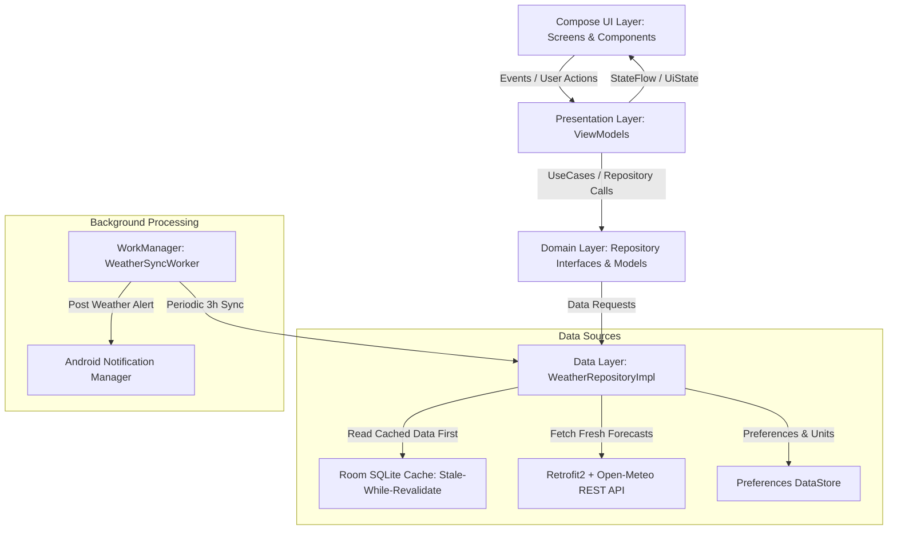

<div align="center">

# 🌤️ WeatherNow — Modern Android Weather Companion

**A state-of-the-art, offline-first Android weather application crafted with Jetpack Compose, Material 3, Clean Architecture, and Coroutines Flow.**

[-3DDC84?logo=android&logoColor=white)](https://developer.android.com)
[](https://kotlinlang.org)
[](https://developer.android.com/jetpack/compose)
[](https://developer.android.com/topic/architecture)
[-brightgreen?logo=junit5)](file:///d:/WeatherApp_Antigravity_Project_Plan/phase-results/PHASE_9_RESULT.md)
[](LICENSE)

<br/>

</div>

---

## 📱 Visual Showcase & Key Features

| 01. Dynamic Range Bars & 7-Day Forecast | 02. Catmull-Rom Bézier Trend Charts | 03. Native Android Sharesheet |
| :---: | :---: | :---: |
|  |  |  |
| *Floating dynamic range bars with live temperature indicator dot* | *Continuous Bézier spline with interactive touch scrub tooltip* | *Share rich atmospheric briefings via SMS, Zalo, FB, or Clipboard* |

| 04. Synced Favorites & Multi-City | 05. Instant City Switcher Sheet | 06. Dark Theme & Unit Customization |
| :---: | :---: | :---: |
|  |  |  |
| *Live synced active city cards with timezones and weather states* | *Seamless bottom sheet for instant location switching* | *OLED Dark Mode, °C/°F, km/h / m/s, and Bilingual (VI/EN)* |

---

## 🚀 Key Highlights & Capabilities

- 🎨 **Stitch Glassmorphism Design System**: Tailored Material 3 palette, ultra-smooth frosted glass surfaces (`GlassCard`), dynamic status badges, and shimmering skeleton loaders.
- 📊 **Custom Canvas Data Visualization**:
  - **Dynamic Floating Temperature Range Bars**: Apple Weather / Pixel Weather style relative range bars with a glowing live indicator dot for today's temperature.
  - **Catmull-Rom Bézier Temperature Curve**: Touch-scrubbing tooltip to inspect granular hourly temperatures across 24 hours.
  - **Precipitation Bar Chart**: Dynamic probability indicators color-coded from light drizzle to thunderstorms.
- ⚡ **Offline-First & Stale-While-Revalidate**:
  - Instant cold starts powered by **Room SQLite Database** cached forecasts.
  - Seamless background refresh with zero UI freezes via reactive Kotlin Coroutine `Flow`.
- 🔄 **Centralized Active Location Synchronization**:
  - Instant city switching from Home, Favorites, or Search with real-time state propagation across the entire app.
- ⏰ **Background WorkManager Synchronization**:
  - Periodic background sync (every 3 hours) with network constraints (`CONNECTED`) and battery health safeguards.
  - Heads-up system notifications with real-time temperature and weather alerts.
- 🌍 **Internationalization & Unit Flexibility**:
  - Full bilingual support (**Tiếng Việt / English**).
  - Metric & Imperial conversions: Celsius (°C) / Fahrenheit (°F), km/h / m/s, hPa / inHg.
- 📤 **Native Android Sharesheet**: Format and share comprehensive weather briefings in one tap.

---

## 🏗️ Architecture & Engineering Design

WeatherNow is built following **Clean Architecture principles** and the **Unidirectional Data Flow (UDF)** pattern:



### Architectural Principles:
1. **Separation of Concerns**: Strict decoupling of UI (Compose), Domain (Business logic & entities), and Data (Local database & Remote network).
2. **Stale-While-Revalidate Flow**:
   - `observeCurrentWeather(lat, lon)` immediately emits SQLite cached data if available, then triggers a network update and updates the cache automatically.
3. **Resilience & Fallback**:
   - Network errors, 500 server responses, or timeouts gracefully fallback to local cache without crashing the UI.

---

## 🛠️ Technology Stack

| Domain | Technologies & Libraries |
| :--- | :--- |
| **Language & Toolchain** | **Kotlin 2.3+**, Gradle 9.0, Android Gradle Plugin (AGP) 9.0, JDK 17 |
| **UI & Styling** | **Jetpack Compose**, **Material 3**, Navigation 3, Compose Foundation |
| **Asynchronous Programming** | **Kotlin Coroutines**, `StateFlow`, `SharedFlow`, Channels |
| **Local Persistence** | **Room Database (SQLite)** with JSON Converters, **Preferences DataStore** |
| **Networking & Serialization** | **Retrofit 2.11**, **OkHttp 4.12** (Logging Interceptors), **Kotlinx Serialization** |
| **Background Processing** | **Android WorkManager** (Periodic & One-Time Work Requests, Constraints) |
| **System Integrations** | Android Notifications (Notification Channels), Native Intent Sharesheet |
| **Unit & UI Testing** | **JUnit4**, **Robolectric**, **MockK**, **Turbine**, Compose UI Test JUnit4 |

---

## 🧪 Comprehensive Test Suite (Milestone M9)

The project includes **76 unit, integration, and UI tests with a 100% pass rate**:

| Component | Test File | Scope | Status |
| :--- | :--- | :--- | :---: |
| **Background Worker** | `WeatherSyncWorkerTest.kt` | WorkManager periodic sync, retry/backoff constraints | **3/3 PASS** |
| **Resilience & Fallback** | `ErrorHandlingAndResilienceTest.kt` | HTTP 500 / Network timeout fallback to Room SQLite | **2/2 PASS** |
| **Location & Geocoding** | `LocationRepositoryTest.kt` | Open-Meteo geocoding search & recent query storage | **5/5 PASS** |
| **Remote Client** | `OpenMeteoRemoteDataSourceTest.kt` | Retrofit JSON deserialization & endpoints | **7/7 PASS** |
| **Weather Repository** | `WeatherRepositoryTest.kt` | Live reactive flows, hourly/daily forecasts, caching | **5/5 PASS** |
| **Database DAOs** | `CachedWeatherDaoTest.kt`, `FavoriteLocationDaoTest.kt`, `RecentSearchDaoTest.kt` | Room SQLite transactions, CRUD operations | **6/6 PASS** |
| **DataStore Preferences**| `UserPreferencesDataStoreTest.kt`, `WeatherCacheSerializerTest.kt` | Preferences DataStore Flow, Unit serialization | **8/8 PASS** |
| **Mappers & Codes** | `ForecastDtoMapperTest.kt`, `LocationDtoMapperTest.kt`, `WeatherCodeMapperTest.kt` | 28 WMO condition codes (day/night), DTO mapping | **15/15 PASS** |
| **ViewModels** | `HomeViewModelTest`, `SearchViewModelTest`, `FavoritesViewModelTest`, `ForecastViewModelTest`, `SettingsViewModelTest` | StateFlow transitions, city switching, debounced search, favorites actions | **17/17 PASS** |
| **Canvas & Math** | `ChartsAndPolishTest.kt` | Spline interpolation, bounding box, touch scrubbing | **3/3 PASS** |
| **Compose UI Screens** | `ComposeScreensRobolectricTest.kt` | Robolectric UI component rendering (Home, Forecast, Favorites) | **3/3 PASS** |
| **TOTAL** | **Full Architecture Matrix** | **76 Individual Automated Tests** | **100% PASS** |

---

## 📦 Getting Started & Build Instructions

### Prerequisites
- **Android Studio** Ladybug (2024.2+) or newer.
- **JDK 17** configured as Gradle JDK.
- Android Device or Emulator running **Android 8.0 (API 26)** or higher (Target: Android 16 / API 36).

### 1. Clone the Repository
```bash
git clone https://github.com/haitranduc203/WeatherNow-AndroidApp.git
cd WeatherNow-AndroidApp
```

### 2. Run All Automated Unit Tests
```powershell
./gradlew testDebugUnitTest
```

### 3. Build & Install Debug APK on Connected Device
```powershell
./gradlew installDebug
```

### 4. Build Optimized Release APK
```powershell
./gradlew assembleRelease
# Output APK: app/build/outputs/apk/release/app-release-unsigned.apk
```

---

## 📂 Project Structure

```
WeatherNow/
├── app/
│   ├── src/main/java/com/example/weathernow/
│   │   ├── core/
│   │   │   ├── common/         # Constants, Resource wrapper, Extensions
│   │   │   ├── di/             # Manual DI Container (AppContainer)
│   │   │   ├── notification/   # WeatherNotificationManager
│   │   │   └── worker/         # WeatherSyncWorker & WeatherWorkScheduler
│   │   ├── data/
│   │   │   ├── local/          # Room DB, DAOs, Entities, DataStore
│   │   │   ├── mapper/         # Forecast, Location, WeatherCode Mappers
│   │   │   ├── remote/         # Retrofit API, DTOs, Remote Data Source
│   │   │   └── repository/     # WeatherRepositoryImpl, LocationRepositoryImpl
│   │   ├── domain/
│   │   │   ├── model/          # WeatherLocation, CurrentWeather, Forecast, ActiveLocationManager
│   │   │   └── repository/     # WeatherRepository, LocationRepository interfaces
│   │   ├── presentation/
│   │   │   ├── components/     # GlassCard, TemperatureRangeBar, Bézier Curves, Shimmer
│   │   │   ├── favorites/      # FavoritesScreen & FavoritesViewModel
│   │   │   ├── forecast/       # ForecastScreen & ForecastViewModel
│   │   │   ├── home/           # HomeScreen, HomeViewModel, LocationSwitcherBottomSheet
│   │   │   ├── navigation/     # WeatherNavHost & Screen Routes
│   │   │   ├── search/         # SearchScreen & SearchViewModel
│   │   │   ├── settings/       # SettingsScreen, SettingsViewModel, UserPreferencesRepository
│   │   │   └── util/           # WeatherUnitsFormatter, LocalWeatherStrings, Language
│   │   ├── theme/              # Color, Type, Shape, Theme, Gradients
│   │   └── MainActivity.kt     # Single Activity Entry Point
│   └── src/test/java/          # 76 Unit & Robolectric Compose UI Tests
├── docs/screenshots/           # High-resolution portfolio screenshots
├── phase-results/              # Milestone M0 - M10 audit & delivery reports
└── README.md                   # Master Documentation
```

---

## 🔮 Limitations & Future Roadmap

- [ ] **Interactive Weather Radar Map**: Integrate MapLibre / Google Maps with live atmospheric precipitation overlays.
- [ ] **Home Screen App Widget**: Implement Glance-based Material 3 home screen widgets for glanceable weather updates.
- [ ] **Wear OS Companion**: Standalone Wear OS Compose application for smartwatches.
- [ ] **Severe Weather Emergency Push**: Webhook / FCM integration for government emergency weather sirens.

---

## 📄 License & Attribution

- Built with ❤️ using **Open-Meteo Weather API** (Free & Open-Source, Non-Commercial Weather Data).
- Distributed under the **MIT License**. See `LICENSE` for details.
