# WeatherNow — Android Fresher Portfolio

[](https://github.com/haitranduc203/WeatherNow-AndroidApp/actions/workflows/android.yml)


WeatherNow là ứng dụng thời tiết Native Android được xây dựng như một project portfolio cho vị trí **Android Fresher**. Project tập trung thể hiện cách tổ chức ứng dụng theo các lớp `data` / `domain` / `presentation`, quản lý trạng thái UI bằng ViewModel và Kotlin Flow, lưu trữ cục bộ với Room/DataStore, gọi API bằng Retrofit và xây dựng giao diện hoàn toàn bằng Jetpack Compose.

> Trạng thái: **Fresher portfolio project**, chưa được phát hành lên Google Play và không tuyên bố production-ready. Kiến trúc được lấy cảm hứng từ Clean Architecture nhưng được giữ gọn trong một module, không có use-case layer hoặc dependency-injection framework riêng.

## Tính năng đã triển khai

- Dữ liệu thời tiết hiện tại, dự báo theo giờ và dự báo theo ngày từ [Open-Meteo](https://open-meteo.com/); phía client không cần nhúng API key.
- Biểu đồ nhiệt độ 24 giờ, lượng mưa, dải nhiệt độ 7 ngày và các thẻ thông tin thời tiết bằng Compose Canvas/Material 3.
- Tìm kiếm địa điểm toàn cầu qua Open-Meteo Geocoding, kết hợp danh mục cục bộ 34 đơn vị hành chính Việt Nam và một số đô thị lớn.
- Lấy tọa độ thiết bị thật bằng `FusedLocationProviderClient`. Quyền vị trí chỉ được yêu cầu khi người dùng nhấn **Vị trí của tôi**; khi bị từ chối, timeout hoặc không có vị trí, ứng dụng hiển thị lỗi và vẫn cho phép tìm kiếm thủ công.
- Lưu lịch sử tìm kiếm và danh sách yêu thích bằng Room. Mỗi thẻ yêu thích tải nhiệt độ, trạng thái và min/max từ `WeatherRepository`; không dùng số liệu giả theo tên thành phố.
- Đọc cache thời tiết trước nếu địa điểm đã từng tải thành công, sau đó thử làm mới từ mạng. Khi chưa có cache, ứng dụng cần kết nối mạng để lấy dữ liệu lần đầu.
- Theme sáng/tối/theo hệ thống, tiếng Việt/English, °C/°F và km/h/mph/m/s được lưu bằng DataStore.
- Đồng bộ định kỳ tùy chọn bằng WorkManager với chu kỳ mặc định 3 giờ, yêu cầu có mạng và pin không thấp. Daily summary chỉ được gửi khi người dùng bật cả background refresh và daily notification.
- Test receiver dùng để thử notification/sync chỉ tồn tại trong debug build, đặt `android:exported="false"` và không được đóng gói vào release APK.

Hà Nội là địa điểm mặc định khi mở ứng dụng lần đầu. Đây là giá trị khởi tạo, không được trình bày như vị trí GPS của thiết bị. Vị trí do GPS trả về hiện được hiển thị bằng nhãn “Current location” cùng tọa độ, chưa reverse-geocode thành tên thành phố.

## Giao diện

Các ảnh dưới đây được chụp trên thiết bị vật lý realme RMX3350, Android 13 (API 33).

### Dark theme

<p align="center">
  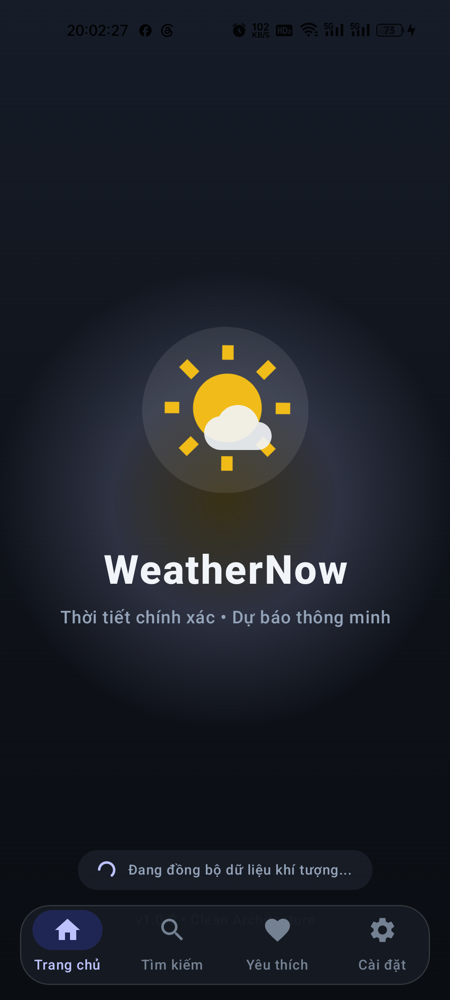
  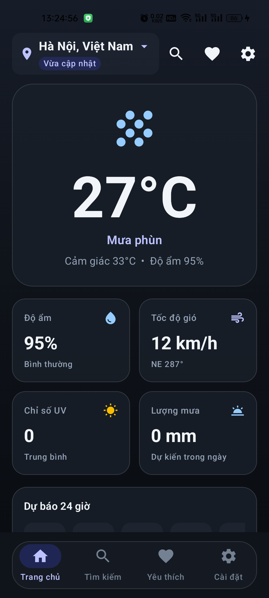
  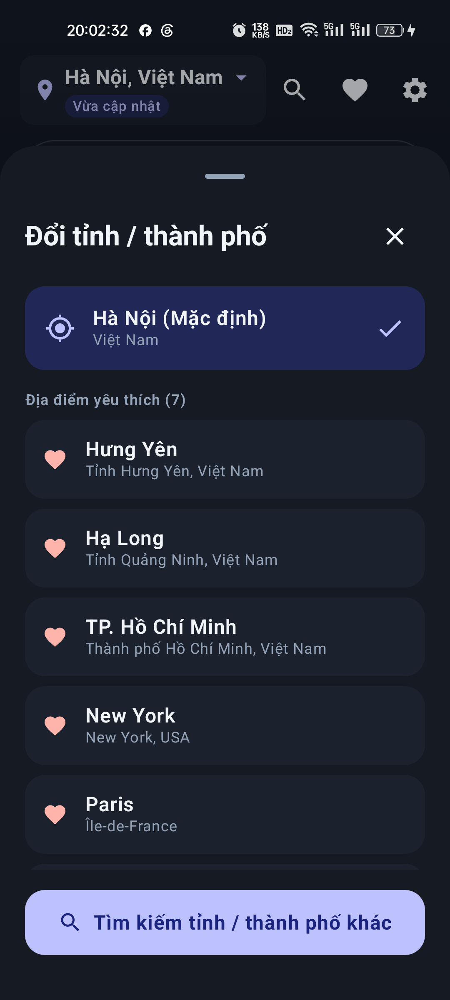
  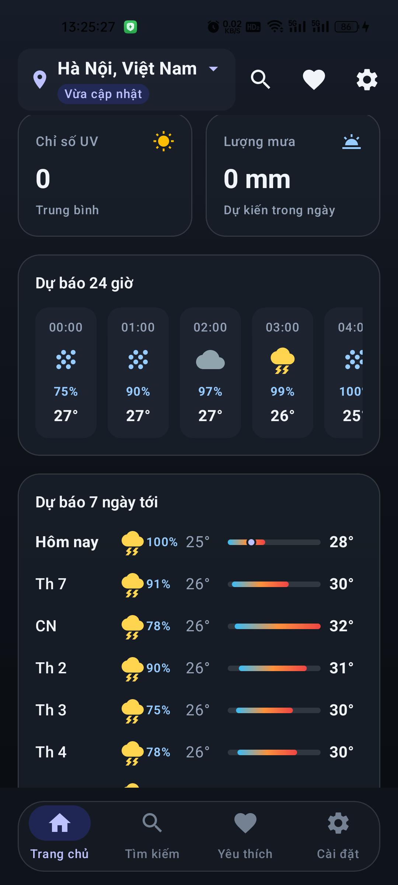
  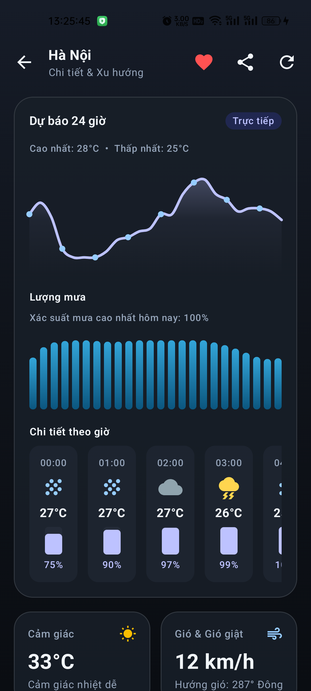
</p>

<p align="center">
  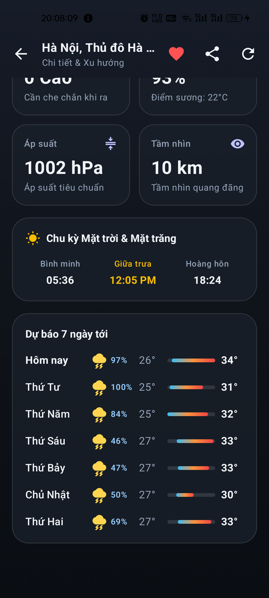
  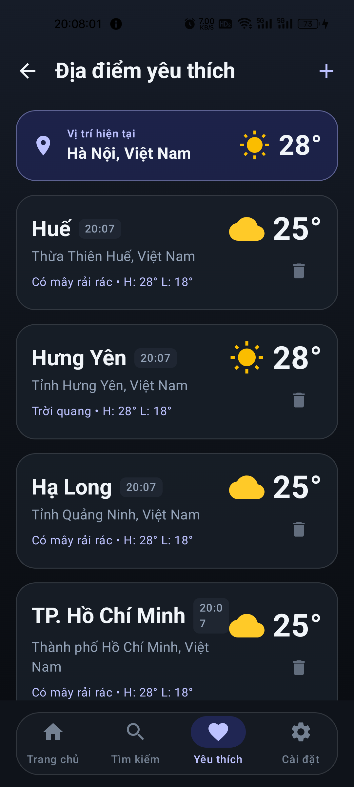
  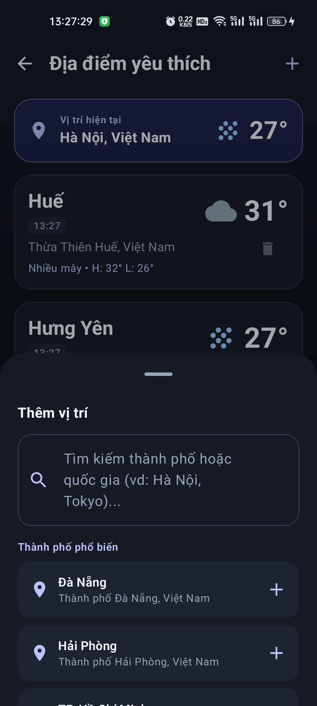
  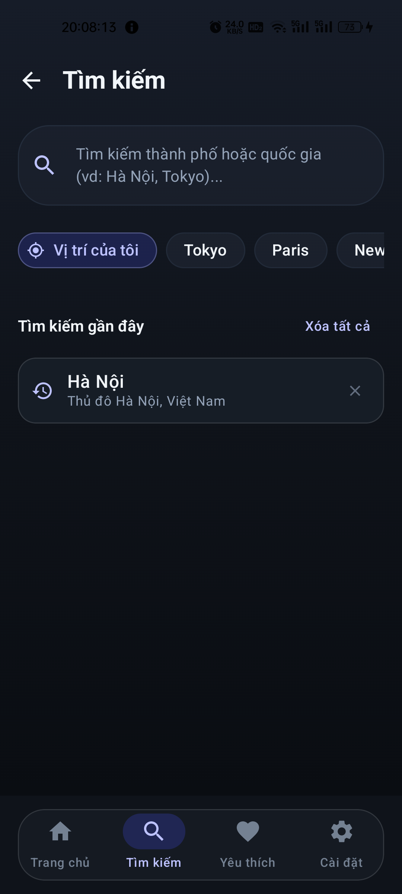
  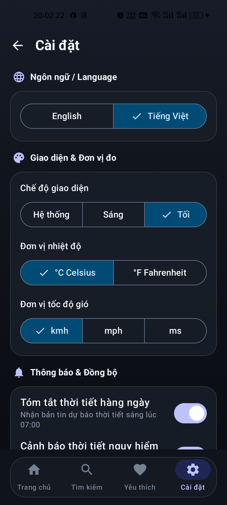
</p>

### Light theme

<p align="center">
  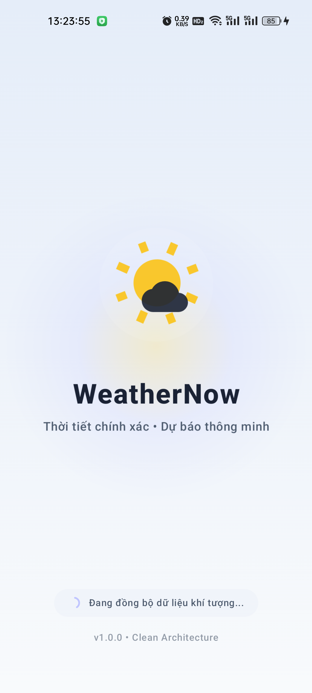
  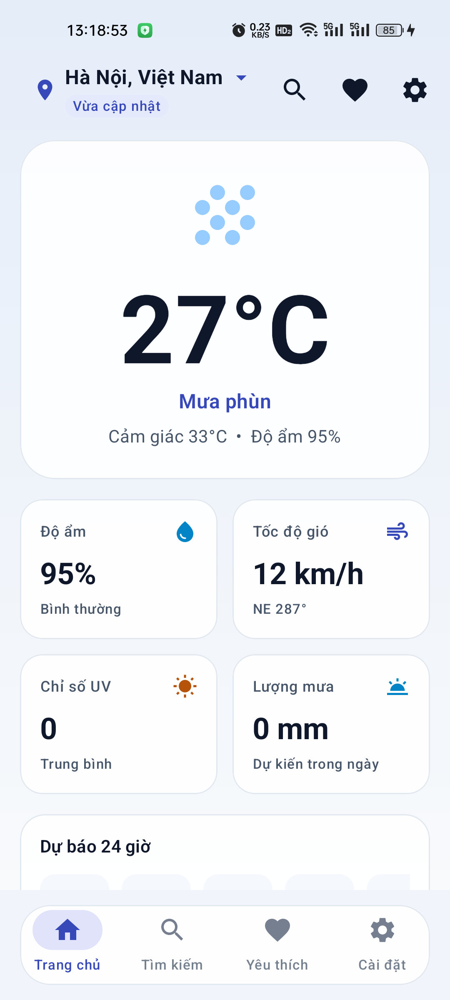
  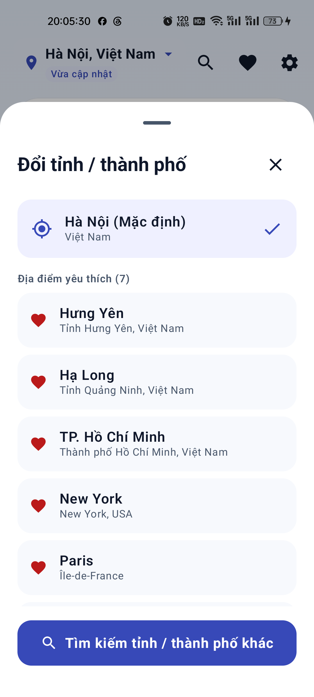
  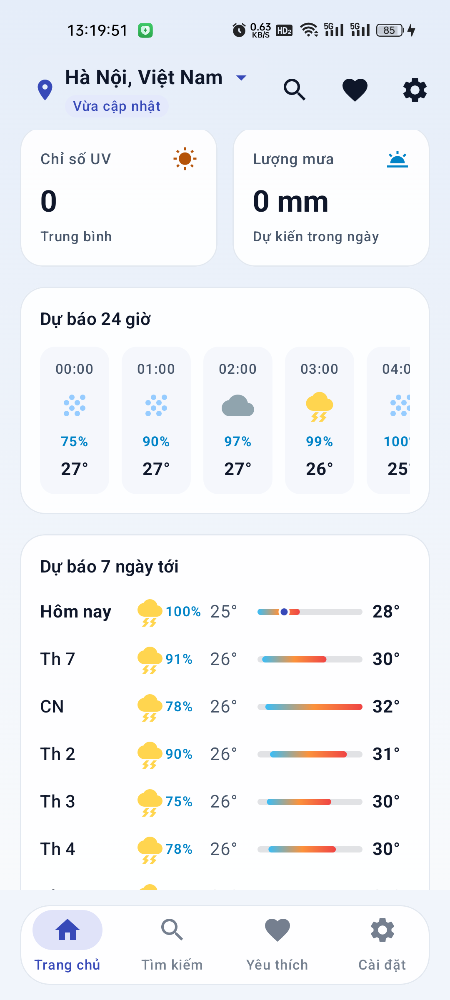
  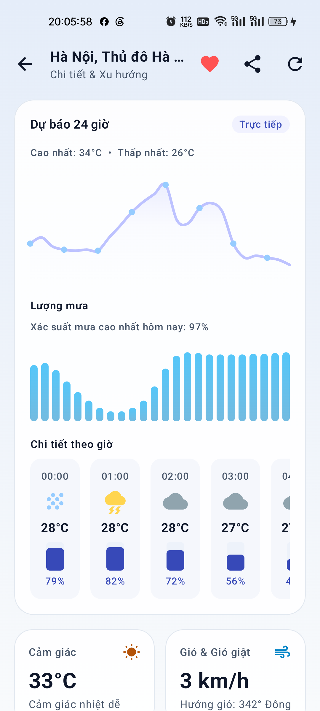
</p>

<p align="center">
  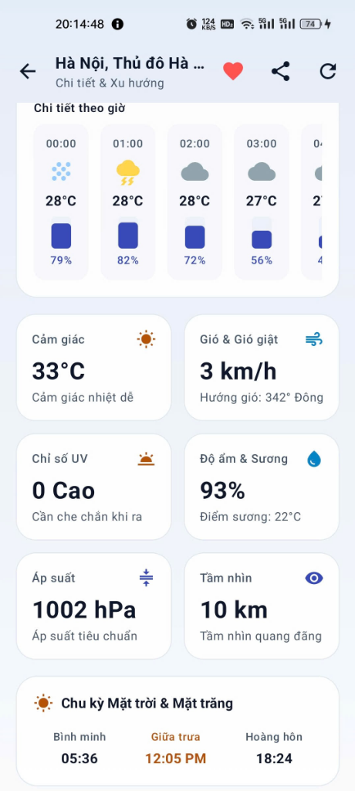
  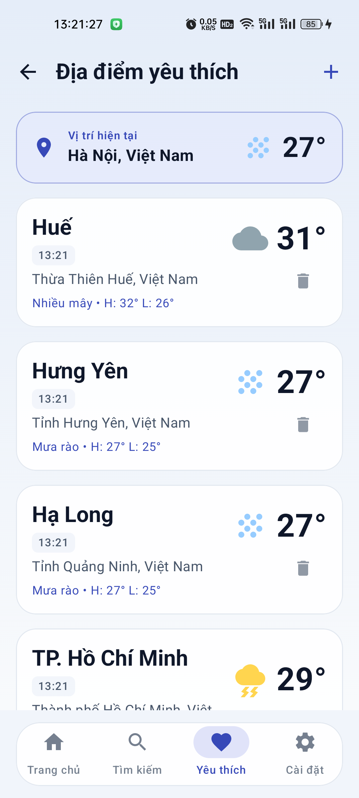
  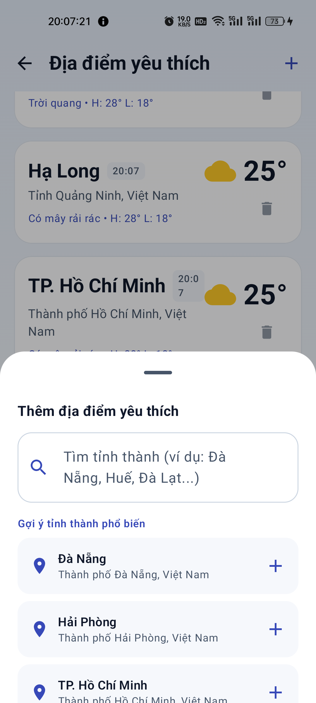
  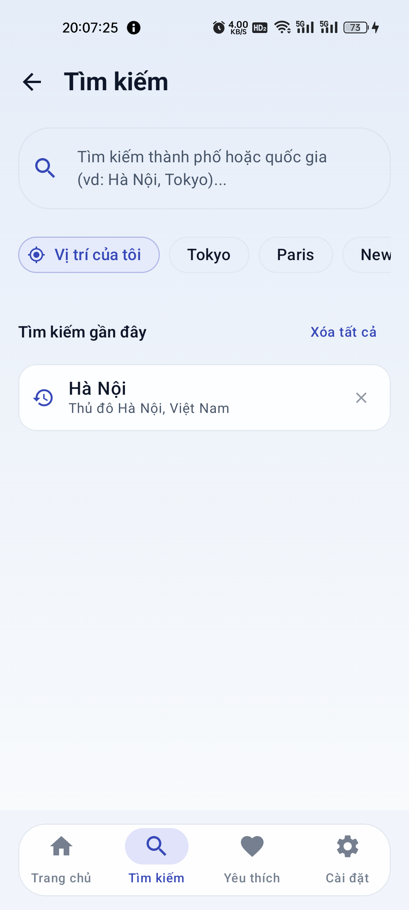
  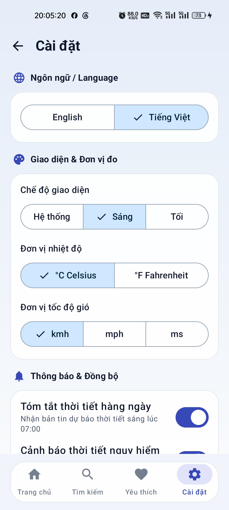
</p>

### Android integration

<p align="center">
  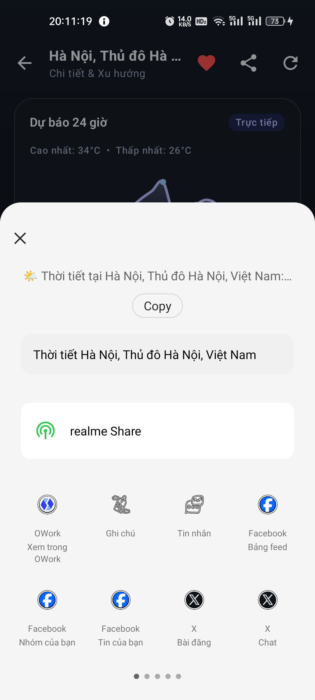
  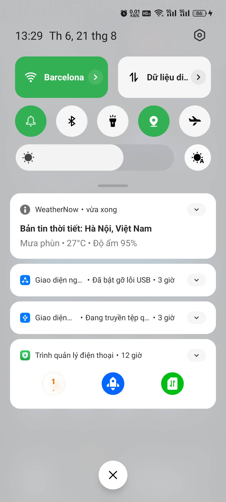
</p>

## Kiến trúc và luồng dữ liệu

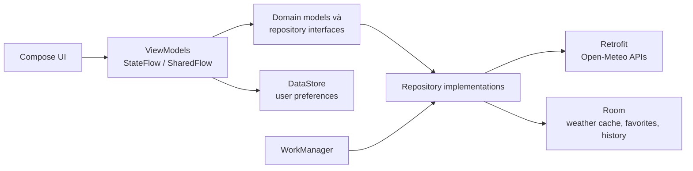

Project dùng `AppContainer` tự viết để nối các dependency trong một app module. UI theo hướng MVVM/UDF: ViewModel phát trạng thái bất biến qua `StateFlow` và nhận hành động từ composable. Repository che giấu nguồn dữ liệu remote/local nhưng project chưa có use-case layer riêng, vì vậy README không gọi đây là “strict Clean Architecture”.

Các DAO one-shot là `suspend`, dữ liệu quan sát liên tục dùng `Flow`, và production database không cho phép main-thread query. Những lớp bắt lỗi bất đồng bộ phải ném lại `CancellationException` để thao tác cũ được hủy đúng khi người dùng đổi màn hình hoặc địa điểm.

### Cache thời tiết

1. Repository tìm cache Room theo khóa tọa độ.
2. Nếu có cache hợp lệ về mặt giải mã, cache được phát ra trước.
3. Repository tiếp tục gọi Open-Meteo và ghi đè cache khi thành công.
4. Nếu mạng lỗi nhưng đã có cache, dữ liệu cũ vẫn được giữ trên UI; nếu chưa có cache, UI nhận trạng thái lỗi.

Đây là cơ chế **cache-first có fallback**, không phải bảo đảm toàn bộ ứng dụng hoạt động offline. Tìm kiếm quốc tế và địa điểm chưa từng tải vẫn cần mạng; tìm kiếm trong danh mục Việt Nam có thể trả kết quả cục bộ khi API không khả dụng.

## Công nghệ

| Nhóm | Công nghệ |
|---|---|
| Nền tảng | Kotlin 2.3.20, AGP 9.0.1, JDK 17, minSdk 26, target/compileSdk 36 |
| UI | Jetpack Compose BOM 2026.03.01, Material 3, Navigation 3 1.0.1 |
| Bất đồng bộ | Kotlin Coroutines 1.10.2, Flow, StateFlow, SharedFlow |
| Mạng | Retrofit 2.11.0, OkHttp 4.12.0, Kotlinx Serialization 1.7.3 |
| Lưu trữ | Room 2.6.1, DataStore Preferences 1.1.2 |
| Android services | Play Services Location 21.3.0, WorkManager 2.10.0 |
| Kiểm thử | JUnit 4, Robolectric, MockK, Turbine, Coroutines Test, Room/WorkManager testing |

## Cài đặt và chạy

Yêu cầu:

- Android Studio hỗ trợ AGP 9.0.1
- JDK 17
- Android SDK 36
- Thiết bị hoặc emulator API 26+

Project không cần API key. `local.properties` chỉ cần trỏ tới Android SDK cục bộ và thường được Android Studio tự tạo.

```bash
git clone https://github.com/haitranduc203/WeatherNow-AndroidApp.git
cd WeatherNow-AndroidApp
```

Windows PowerShell:

```powershell
.\gradlew.bat assembleDebug
```

macOS/Linux:

```bash
./gradlew assembleDebug
```

Cài APK debug bằng ADB trên Windows:

```powershell
& "$env:LOCALAPPDATA\Android\Sdk\platform-tools\adb.exe" install -r app/build/outputs/apk/debug/app-debug.apk
```

## Kiểm thử và CI

Lần xác minh cục bộ gần nhất ngày **21/08/2026** có **135/135 JVM unit và Robolectric tests** đạt, 0 failure và 0 error. Con số này không phải tuyên bố code coverage 100% và không bao gồm một bộ end-to-end/instrumented test chạy trên Firebase Test Lab.

Chạy gate đầy đủ tại máy local:

```powershell
.\gradlew.bat testDebugUnitTest lintDebug assembleDebug assembleRelease
```

Workflow [`.github/workflows/android.yml`](.github/workflows/android.yml) hiện chỉ chạy các bước sau trên Ubuntu/JDK 17:

1. `./gradlew testDebugUnitTest`
2. `./gradlew assembleDebug`
3. Upload debug APK làm artifact

Lint và release build hiện được kiểm tra local, chưa nằm trong CI.

## Quyết định kỹ thuật đáng chú ý

| Vấn đề | Cách xử lý | Đánh đổi hiện tại |
|---|---|---|
| Vị trí thiết bị | Ưu tiên last location không quá 5 phút; nếu cũ/rỗng thì xin current location với balanced-power accuracy và timeout 15 giây | Chưa reverse-geocode tọa độ thành tên thành phố hoặc timezone |
| Hiển thị khi mất mạng | Phát cache trước rồi làm mới từ API | Chỉ hữu ích sau khi địa điểm đã từng được tải thành công; chưa có chính sách TTL/độ cũ rõ ràng trên UI |
| Favorites nhiều địa điểm | `flatMapLatest` và `combine` các flow thời tiết theo tọa độ | Mỗi địa điểm có thể tạo request riêng; chưa tối ưu batching |
| Room threading | DAO one-shot dùng `suspend`, observed data dùng `Flow`, không bật `allowMainThreadQueries()` | Chưa có migration vì database vẫn ở version 1 |
| Hủy coroutine | Rethrow `CancellationException` qua data/repository layer | Cần tiếp tục giữ quy tắc này khi thêm các data source mới |
| Test broadcast receiver | Chỉ đặt trong debug source set và `exported=false`; release manifest/DEX không chứa receiver | Chỉ phục vụ development build |

## Giới hạn hiện tại

- Android 13+ hiện yêu cầu quyền notification ngay lần mở đầu nếu chưa được cấp. Đây là UX cần cải thiện để chỉ hỏi sau khi người dùng chủ động bật notification.
- Hà Nội là home mặc định và bốn starter favorites (Hà Nội, Tokyo, Paris, New York) được seed khi database yêu thích còn trống.
- Cache không bảo đảm mọi luồng offline; dữ liệu chưa từng tải và tìm kiếm quốc tế vẫn cần mạng.
- Hàm dựng severe-weather notification đã có nhưng production flow hiện chưa kích hoạt cảnh báo thời tiết cực đoan tự động.
- Release build hiện chưa bật minification và repository chưa cấu hình quy trình ký/phát hành Google Play.
- Automated tests chủ yếu là JVM/Robolectric; chưa có bộ instrumented UI test chạy trên thiết bị trong CI.
- Repository hiện chưa có file license, vì vậy project chưa tuyên bố giấy phép nguồn mở.

## Hướng phát triển

- Chuyển notification permission sang luồng xin quyền theo hành động người dùng.
- Reverse geocoding cho vị trí thiết bị và lưu timezone chính xác.
- Bổ sung cache freshness/TTL hiển thị rõ cho người dùng.
- Đưa lint, release build và instrumented smoke tests vào CI.
- Bổ sung weather radar và Android home-screen widget sau khi các nền tảng kiểm thử/phát hành ổn định.

## Tác giả

**Trần Đức Hải** — [github.com/haitranduc203](https://github.com/haitranduc203)
