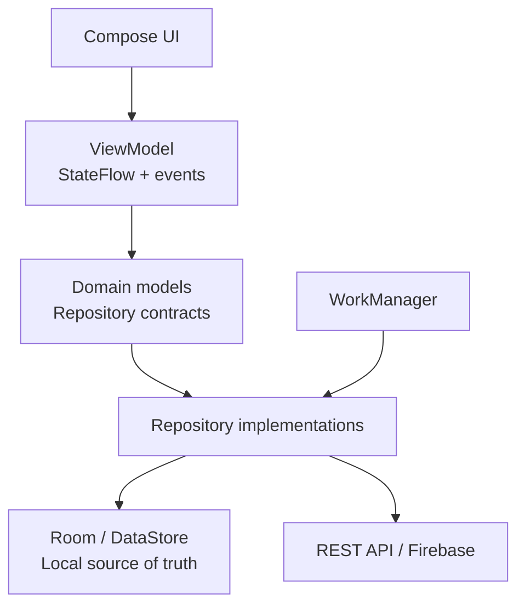

# [PROJECT_NAME] — [Mô tả ngắn 3–6 từ]

[](https://github.com/[GITHUB_USERNAME]/[REPOSITORY]/actions/workflows/[WORKFLOW_FILE].yml)


`[PROJECT_NAME]` là [loại ứng dụng] được xây dựng để giải quyết [vấn đề người dùng]. Dự án tập trung vào [2–4 vấn đề kỹ thuật đáng chú ý, ví dụ: offline-first, phân tách dữ liệu theo user, đồng bộ nền và khả năng kiểm thử].

> Trạng thái: [portfolio/demo | production-ready prototype | learning project]. [Lưu ý quan trọng, ví dụ: payment chỉ dùng Sandbox, không xử lý tiền thật.]

<!-- Nếu có video demo, đặt ngay dưới phần mở đầu. -->

[▶ Xem video demo](https://youtu.be/[VIDEO_ID])

## Điểm nổi bật

- [Kiến trúc chính, ví dụ: Clean Architecture, MVVM và UDF.]
- [UI, ví dụ: Kotlin + Jetpack Compose, single-activity.]
- [Dữ liệu local, ví dụ: Room là local source of truth.]
- [Remote/backend, ví dụ: Firebase Auth, Firestore và Cloud Functions.]
- [Tính năng nổi bật, ví dụ: Paging 3, filter/sort và SavedStateHandle.]
- [Background sync, ví dụ: WorkManager retry khi có mạng.]
- [UI quality, ví dụ: dark/light theme, localization, accessibility, adaptive layout.]
- [Quality, ví dụ: unit/DAO/UI/Security Rules tests và CI.]

## Giao diện ứng dụng

<!--
Chụp từ thiết bị thật. Không hiển thị email, số điện thoại, địa chỉ chi tiết,
API key, token hoặc dữ liệu thanh toán thật. Chỉ giữ các ảnh thực sự đại diện
cho tính năng mạnh nhất của project.
-->

<p align="center">
  
  
  
</p>
<p align="center">
  
  
</p>

## Video demo

Video minh họa [luồng chính 1] → [luồng chính 2] → [luồng chính 3], đồng thời nêu [quyết định kỹ thuật nổi bật].

<p align="center">
  <a href="https://www.youtube.com/watch?v=[VIDEO_ID]">
    
  </a>
</p>

## Chức năng

### [Nhóm chức năng 1]

- [Chức năng và giá trị với người dùng.]
- [Chức năng và edge case đã xử lý.]

### [Nhóm chức năng 2]

- [Chức năng chính.]
- [Offline/error/retry/loading state nếu có.]

### [Nhóm chức năng 3]

- [Tính năng nâng cao, ví dụ: payment, map, chat, notification, camera.]
- [Nêu rõ Sandbox/demo nếu không phải production.]

## Kiến trúc



[Mô tả ngắn 2–4 câu về data flow: UI quan sát local data như thế nào, remote refresh cập nhật local cache ra sao, và những thao tác nào bắt buộc qua backend tin cậy.]

### Cấu trúc chính

```text
[PROJECT_NAME]/
├── app/
│   └── src/main/java/[PACKAGE_NAME]/
│       ├── data/           # DAO, Entity, DTO, Mapper, Repository implementation
│       ├── domain/         # Domain model và repository contract
│       ├── presentation/   # Compose screen, ViewModel, navigation
│       └── di/             # Hilt/Koin module
├── functions/              # Optional: trusted backend
├── app/src/test/           # JVM unit tests
├── app/src/androidTest/    # Instrumented/UI/DAO tests
└── .github/workflows/      # CI
```

## Công nghệ

| Nhóm | Công nghệ |
|---|---|
| Language/build | Kotlin [VERSION], Gradle Kotlin DSL, JDK [VERSION] |
| UI | Jetpack Compose, Material 3, [Coil/Navigation/other] |
| Architecture | [Clean Architecture, MVVM, UDF, Coroutines, Flow] |
| Local data | [Room, DataStore, Paging 3] |
| Remote/backend | [Firebase/REST API/Cloud Functions] |
| Dependency injection | [Hilt/Koin] |
| Background work | [WorkManager hoặc N/A] |
| Quality | [JUnit, MockK, Turbine, UI Test, CI] |
| Performance | [Baseline Profile, Macrobenchmark, R8 hoặc N/A] |

## Bảo mật và tính toàn vẹn dữ liệu

<!-- Giữ phần này chỉ khi có nội dung thật. Không hứa những thứ project chưa làm. -->

- [Secret/API key không được commit hoặc nằm trong APK.]
- [Backend xác thực user và kiểm tra ownership.]
- [Server tính lại dữ liệu nhạy cảm, ví dụ: price, stock, permission.]
- [Transaction/idempotency/retry giải quyết race condition như thế nào.]
- [Security Rules/authorization bảo vệ dữ liệu user.]

## Yêu cầu môi trường

- Android Studio hỗ trợ Android Gradle Plugin [VERSION].
- Android SDK [COMPILE_SDK], thiết bị/emulator từ API [MIN_SDK].
- JDK [VERSION] trở lên.
- [Tài khoản Firebase/API key/backend service nếu cần.]
- [Node.js/Firebase CLI nếu project có Functions.]

## Chạy ứng dụng từ clean clone

### 1. Clone repository

```bash
git clone https://github.com/[GITHUB_USERNAME]/[REPOSITORY].git
cd [REPOSITORY]
```

### 2. Cấu hình local secrets hoặc service

```text
# Ví dụ, thay bằng yêu cầu thật của project:
app/google-services.json
local.properties
functions/.secret.local
```

Nêu rõ:

- File nào cần tự tạo.
- Cách lấy cấu hình mà không lộ secret.
- Project vẫn build được hay không nếu thiếu service thật.

### 3. Build và chạy

Windows PowerShell:

```powershell
.\gradlew.bat testDebugUnitTest lintDebug assembleDebug
```

macOS/Linux:

```bash
./gradlew testDebugUnitTest lintDebug assembleDebug
```

Sau đó mở project bằng Android Studio, chọn thiết bị và chạy configuration `app`.

## [Optional] Chạy backend hoặc tính năng tích hợp

Chỉ giữ section này nếu project thực sự cần backend local, emulator, mock server hoặc dịch vụ bên ngoài.

```powershell
# Ví dụ:
.\scripts\start-local-backend.ps1
```

Nêu rõ backend làm gì, secret được lưu ở đâu, cách kết nối thiết bị và khác biệt giữa local/cloud.

## Kiểm thử

```powershell
# JVM unit tests
.\gradlew.bat testDebugUnitTest

# Lint và debug build
.\gradlew.bat lintDebug assembleDebug

# Instrumented/UI tests trên thiết bị hoặc emulator
.\gradlew.bat connectedDebugAndroidTest

# Optional: backend/security rules tests
cd functions
npm ci
npm test
```

GitHub Actions tự động chạy:

1. [Backend/Rules tests nếu có.]
2. Android unit tests.
3. Android Lint.
4. Debug build.
5. Release/minify build nếu có.
6. Upload APK/coverage artifacts nếu có.

## Các quyết định kỹ thuật đáng chú ý

| Vấn đề | Cách xử lý | Trade-off / lý do |
|---|---|---|
| [Ví dụ: app cần chạy khi mất mạng] | [Room local source of truth + remote refresh] | [Dữ liệu có thể cũ tạm thời nhưng UI phản hồi ngay] |
| [Ví dụ: dữ liệu của nhiều user] | [Mọi query/mutation kèm userId] | [Schema phức tạp hơn nhưng tránh lộ dữ liệu] |
| [Ví dụ: thao tác nhạy cảm] | [Trusted backend + transaction] | [Cần backend nhưng không tin client] |
| [Ví dụ: event Compose chạy lặp] | [SharedFlow/channel cho one-time event] | [Tách state render và side effect] |

## Giới hạn hiện tại và hướng phát triển

- [Giới hạn thật 1: nêu rõ phạm vi demo/sandbox.] 
- [Giới hạn thật 2: nêu rõ việc chưa triển khai production.] 
- [Hướng phát triển khả thi 1.] 
- [Hướng phát triển khả thi 2.] 

## Tài liệu liên quan

- [Backend setup](functions/README.md)
- [Security Rules](firestore.rules)
- [API documentation / Figma / architecture diagram nếu có]

## Tác giả

Phát triển bởi [[YOUR_NAME]](https://github.com/[GITHUB_USERNAME]) cho mục đích [học tập/portfolio/sản phẩm].

[Chọn license thật hoặc ghi rõ điều kiện tái sử dụng source code.]

---

## Checklist trước khi public README

- [ ] Thay toàn bộ `[PLACEHOLDER]`.
- [ ] Xóa section không áp dụng thay vì để `N/A` quá nhiều.
- [ ] Kiểm tra ảnh không lộ dữ liệu cá nhân hoặc secret.
- [ ] Chỉ nêu công nghệ/tính năng đã thực sự làm.
- [ ] Kiểm tra tất cả link GitHub, video, screenshot và tài liệu.
- [ ] Xác nhận lệnh clean clone chính xác.
- [ ] Nêu rõ giới hạn Sandbox/demo để không gây hiểu nhầm.
